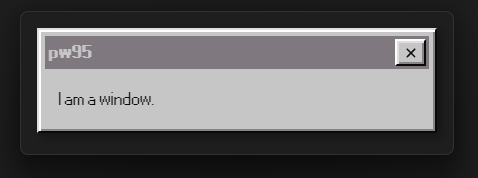
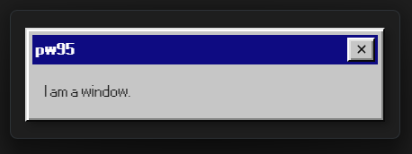

# pw95
A [Windows 95](https://en.wikipedia.org/wiki/Windows_95) style window in [Tauri](https://tauri.app/) with [React](https://react.dev/) and [React95](https://react95.io).

## Linux Build:
This is the folder where the Linux installer files will be stored once made.
They will also be stored in the [Releases tab](https://github.com/95rs/pw95/releases) once made.

## Windows Build:
This is the folder where the Windows installer files are stored.
They are also stored in the [Releases tab](https://github.com/95rs/pw95/releases).

## Related:

### Demo:
It's recommended to see what this projects output will be like on your computer before using.

For a demo run these steps:
- For Windows:
    - Download the Windows x64 `.msi` or `.exe` installer file from the [Releases tab](https://github.com/95rs/pw95/releases).
- For Linux:
    - Not available at the moment.
- For MacOS:
    - Will not be made at all. See disclamers at the bottom of the readme for more info.

### Get started using this:
> [!WARNING]
> You will need to change the `YOUR_USERNAME` bit in the URL of cloning the project fork command.

1. Fork this project by going to the [fork page](https://github.com/95rs/pw95/fork)
2. Clone the fork using: `git clone https://github.com/YOUR_USERNAME/pw95.git`
3. Install the dependencies using [npm](https://npmjs.com): `npm install`
4. Run the project using: `npm run tauri dev`

Done in 4 simple steps.. How easy was that.
Now you can edit the files to how you would want your program to look and function.

### Disclamers:
- MacOS support will not be made at all.
    - I will not add MacOS at all and if you want to use it then you will need to build it yourself.

- Any errors have to be submitted to the [issues tab](https://github.com/95rs/pw95/issues).
    - Any where else apart from the [issues tab](https://github.com/95rs/pw95/issues) and the [pull requests tab](https://github.com/95rs/pw95/pulls) will not be fixed.
